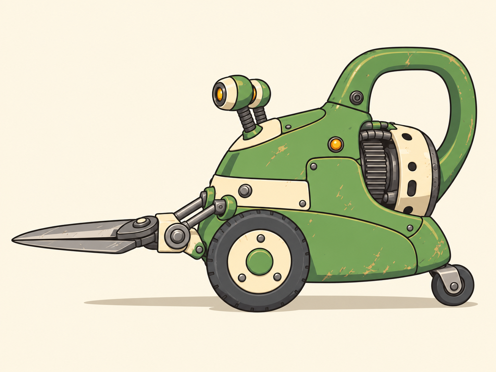

# Clipper

**Approved visual direction (C11):** [Hand-drawn 2D](../style-guide.md) — clean outlines, flat colors, cel shadows and layered scenery. [Selected references](../../concept-art/README.md).

**Asset ID:** R01\
**Category:** robots\
**First appearance:** Level 1\
**Design status:** B — Sturdy retro machine identity retained (C10); generated 2D reference selected (C11). Sprite scale and animation construction remain provisional.

## Selected visual reference

Use [2D B — Sturdy retro machine](../../concept-art/r01-clipper/r01-clipper-2d-v1.png) as the primary visual reference. See the [selection record](../../concept-art/r01-clipper/SELECTED.md) for confirmed features and sprite handoff notes.



B's separate eye stalks and sturdy retro-appliance construction define the selected design.

## Identity and role

Ground charger; a gardening machine still trying to prune everything in its route.

## Scale and silhouette

0.85 m tall, 1.05 m long with shears closed; approximately half the hero's height.

A low pear-shaped motor housing on two broad rubber wheels, with a small rear balance roller. The front is dominated by exactly two thick hedge-shear blades forming a horizontal V. Two circular amber eye lenses sit above the blades, each on its own short flexible ribbed stalk mounted into a shared ivory upper panel.

Use a neutral 1.70 m human silhouette as a temporary scale reference on a separate comparison sheet. The hero's final design is not fixed by this measurement.

## Appearance and construction

The upper shell resembles a green watering can with its handle integrated into the back. Rounded stamped-enamel service panels, a broad ivory horizontal service band, a few large fasteners, and simple wide tire grooves give B its sturdy retro-machine construction. Each eye has its own short ribbed stalk and circular lens housing. Exactly two broad, tapered hedge-shear blades share a substantial front hinge bracket with a visible vertical pivot axis, opening as a horizontal V. Two short drive rods connect that bracket to the motor housing. A rear service hatch and circular guard frame the recessed ribbed motor. Preserve clean metallic cutting bevels, practical tapered tips, and uncovered circular eye lenses.

## Color and materials

Leaf green enamel #6EAD48; warm ivory #EFE5CF; graphite rubber #303B39; amber warning lens #FFB547. Dry scratches and grass residue collect low on the shell; keep the eyes and hinges clean.

Color values are palette targets for later material work; image generators may approximate them. Pair important cues with geometry, posture, and contrast so they do not depend on color alone.

## Abilities and movement

Charges along a platform and attacks with its shears. It cannot follow a jumping hero into the air. A collision with a wall creates a recovery opening.

Rolls with an eager forward lean. Before charging, both short eye stalks draw back together, wheels scrape, and the shears spread wider. The blades clamp shut on impact. A missed charge into a wall leaves the tips lodged while the wheels spin.

## Openings and limitations

The ribbed rear motor is the target during a failed charge. Show it as a recessed mechanical part with a broken circular guard; it is not organic tissue.

## Parts to keep separate for animation

Main shell and service panels; integrated handle; two wheels and one rear roller; shared ivory eye-mount panel; two separate ribbed eye stalks and two lens housings; two shear blades; front pivot bracket and paired drive rods; rear motor and hatch. Keep blade hinges outside the silhouette of the wheels.

Plan overlapping drawing layers and visible pivots for the intended animation method. Keep projectiles, attack trails, warning overlays, impacts and environmental props separate from the character or weapon. These are illustrated components, not a mandated rig: frame-by-frame, cutout or hybrid animation remains a later production choice.

## Required pose and state references

Neutral shears closed; anticipation with open V; forward charge; blades stuck in wall; rear motor exposed; disabled with wheels settled.

Make these as separate studies using the selected B image. Establish its closed-shear neutral pose first; then preserve that same anatomy, eye-stalk arrangement, panels and equipment in later poses.

## Consistency rules

Exactly two shear blades, two main wheels, one rear roller, and two eyes on two separate short stalks. No shared eye neck, humanoid arms, legs, flesh, decorative spikes, or hooked blades. Preserve B's low wheeled silhouette and horizontal shear opening.

Anatomical left and right refer to the subject's own sides, not the viewer's. Do not automatically mirror an asymmetrical design when generating the opposite view.

## Image prompt 1 — neutral design

Attach the selected B image and copy the block below. Use it to refine or reconstruct the selected identity, not to explore a different Clipper design. The [2D continuation prompt](../../concept-art/r01-clipper/generation-prompt.md) supports further art in the selected style.

```text
Original hand-drawn 2D game concept art for DEAD EDEN, a colorful side-scrolling platformer shooter. Match the selected 2D Clipper, Resident and Sunnyvale references: confident dark olive or warm charcoal outlines, heavier outer contours, restrained interior lines, broad flat local colors, one or two crisp cel-shaded shadow shapes, and sparse graphic highlights. Use chunky rounded silhouettes and a few readable functional details. Describe enamel, ceramic, rubber, steel, skin and cloth through drawn shapes and marks rather than realistic reflections or surface rendering. Use only subtle painted texture inside large color areas. Preserve each asset's own palette; Sunnyvale colors do not replace other regions' palettes. Organic forms remain intact, with gentle eerie humor and no exposed viscera. No photorealism, volumetric lighting, ambient occlusion or franchise assets.

Preserve the attached selected Clipper B — Sturdy retro machine design. Match its proportions, separate eye stalks, rounded service panels, ivory band, handle, wheel spacing and substantial shear mechanism. Role: Ground charger; a gardening machine still trying to prune everything in its route.
Scale: 0.85 m tall, 1.05 m long with shears closed; approximately half the hero's height.
Silhouette: A low pear-shaped motor housing on two broad rubber wheels, with a small rear balance roller. The front is dominated by exactly two thick hedge-shear blades forming a horizontal V. Two circular amber eye lenses sit above the blades, each on its own short flexible ribbed stalk mounted into a shared ivory upper panel.
Physical design: The upper shell resembles a green watering can with its handle integrated into the back. Rounded stamped-enamel service panels, a broad ivory horizontal service band, a few large fasteners, and simple wide tire grooves give B its sturdy retro-machine construction. Each eye has its own short ribbed stalk and circular lens housing. Exactly two broad, tapered hedge-shear blades share a substantial front hinge bracket with a visible vertical pivot axis, opening as a horizontal V. Two short drive rods connect that bracket to the motor housing. A rear service hatch and circular guard frame the recessed ribbed motor. Preserve clean metallic cutting bevels, practical tapered tips, and uncovered circular eye lenses.
Materials and colors: Leaf green enamel #6EAD48; warm ivory #EFE5CF; graphite rubber #303B39; amber warning lens #FFB547. Dry scratches and grass residue collect low on the shell; keep the eyes and hinges clean.
Critical consistency: Exactly two shear blades, two main wheels, one rear roller, and two eyes on two separate short stalks. No shared eye neck, humanoid arms, legs, flesh, decorative spikes, or hooked blades. Preserve B's low wheeled silhouette and horizontal shear opening.
Use a relaxed neutral pose that reveals the silhouette and joint structure; no active attacks or enemies nearby.

One complete hand-drawn 2D subject only, centered and fully visible on flat warm off-white with a simple flat contact shadow. Use a readable gameplay side pose with generous margins; preserve the selected reference's identity and proportions. Use clean outlines, flat local colors and crisp cel shadows. No studio-light gradients, perspective camera effects, environment, action effects, UI, watermark, labels, measurement arrows or unrelated props. Preserve stated limb and part counts. Draw one subject, not a multi-panel sheet.
```
## Image prompt 2 — directional sprite study

Attach the approved neutral image as the visual reference. If a multi-view sheet changes the design, request each view individually with the same reference and reconcile inconsistencies before sprite production.

```text
Use the selected hand-drawn 2D style: clean dark outlines, flat painted colors and crisp cel shadows; preserve the attached 2D identity reference.

Create a clean hand-drawn 2D directional sprite study of the attached selected Clipper B — Sturdy retro machine design for DEAD EDEN. This is the same exact asset, not a redesign. Show left-facing and right-facing gameplay side poses as separate drawings. Preserve anatomical left/right equipment; do not mirror asymmetry blindly. Use the same canvas scale and foot baseline in both directions, preserving the stated hover height for floating designs. Use consistent flat colors and cel shadows and a plain light-gray background. Maintain these proportions: 0.85 m tall, 1.05 m long with shears closed; approximately half the hero's height. Maintain these defining forms: A low pear-shaped motor housing on two broad rubber wheels, with a small rear balance roller. The front is dominated by exactly two thick hedge-shear blades forming a horizontal V. Two circular amber eye lenses sit above the blades, each on its own short flexible ribbed stalk mounted into a shared ivory upper panel. Preserve construction: The upper shell resembles a green watering can with its handle integrated into the back. Rounded stamped-enamel service panels, a broad ivory horizontal service band, a few large fasteners, and simple wide tire grooves give B its sturdy retro-machine construction. Each eye has its own short ribbed stalk and circular lens housing. Exactly two broad, tapered hedge-shear blades share a substantial front hinge bracket with a visible vertical pivot axis, opening as a horizontal V. Two short drive rods connect that bracket to the motor housing. A rear service hatch and circular guard frame the recessed ribbed motor. Preserve clean metallic cutting bevels, practical tapered tips, and uncovered circular eye lenses. Preserve the palette: Leaf green enamel #6EAD48; warm ivory #EFE5CF; graphite rubber #303B39; amber warning lens #FFB547. Dry scratches and grass residue collect low on the shell; keep the eyes and hinges clean. Lock these details: Exactly two shear blades, two main wheels, one rear roller, and two eyes on two separate short stalks. No shared eye neck, humanoid arms, legs, flesh, decorative spikes, or hooked blades. Preserve B's low wheeled silhouette and horizontal shear opening. Keep all parts fully in frame and clearly separated; show all required views without overlap. Use a neutral repeatable pose, no action effects, no scenery. Do not mirror asymmetric features. No labels, text, measuring graphics, cutaway internals, or dramatic perspective. Match the reference rather than inventing unseen decoration.
```
## Image prompt 3 — action and function studies

Use the approved neutral reference. Request one listed state per generation for the clearest sprite and animation reference; repeat for the other states. A support object or arena fragment may appear only where needed to explain contact or scale.

```text
Use the selected hand-drawn 2D style: clean dark outlines, flat painted colors and crisp cel shadows; preserve the attached 2D identity reference.

Using the attached selected Clipper B reference, draw one clear full-subject hand-drawn 2D animation key pose in strict gameplay side view, showing one state selected from this list: Neutral shears closed; anticipation with open V; forward charge; blades stuck in wall; rear motor exposed; disabled with wheels settled. If no state is specified, show the main attack anticipation; for a weapon show a simplified hand-contact study of its standard firing pose. Preserve anatomy, proportions, colors, attachments, and all part counts. Movement language: Rolls with an eager forward lean. Before charging, both short eye stalks draw back together, wheels scrape, and the shears spread wider. The blades clamp shut on impact. A missed charge into a wall leaves the tips lodged while the wheels spin. Capability: Charges along a platform and attacks with its shears. It cannot follow a jumping hero into the air. A collision with a wall creates a recovery opening. Important limitation or opening: The ribbed rear motor is the target during a failed charge. Show it as a recessed mechanical part with a broken circular guard; it is not organic tissue.   Keep effects small and separate enough that the body or weapon silhouette is visible. Plain light-gray background; no cinematic framing, text, labels, motion blur, or new equipment. The pose must use the exact approved design.
```
## Before sprite production

- Use the selected 2D reference, or select a neutral image for an asset that has no approved image yet, before producing animation poses.
- Keep anatomy, asymmetric attachments, outlines, palette and part counts consistent in left- and right-facing art.
- Check silhouette and target readability at intended gameplay size and in grayscale.
- Establish a consistent canvas, foot baseline, weapon grip and pivot intent; draw a few key poses before adding small details.
- Keep effects and moving pieces separate. A concept PNG is not a finished sprite sheet, layered source file or validated animation.

See [shared style guide](../style-guide.md) and [asset index](../README.md).
