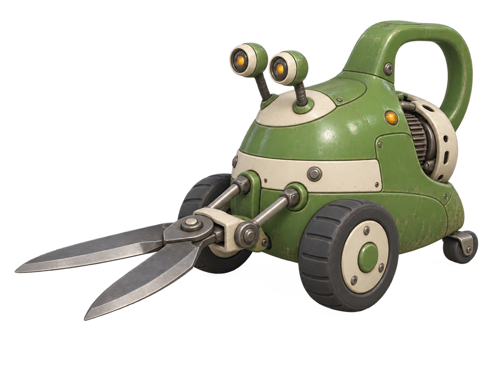

# Clipper

**Asset ID:** R01\
**Category:** robots\
**First appearance:** Level 1\
**Design status:** B — Sturdy retro machine selected by the user (decision C10). Dimensions and hidden geometry remain provisional.

## Selected visual reference

Use [B — Sturdy retro machine](../../concept-art/r01-clipper/r01-clipper-b-retro-v1.png) as the primary visual reference. See the [selection record](../../concept-art/r01-clipper/SELECTED.md) for confirmed features and modeling handoff notes.



B's separate eye stalks and sturdy retro-appliance construction define the selected design.

## Identity and role

Ground charger; a gardening machine still trying to prune everything in its route.

## Scale and silhouette

0.85 m tall, 1.05 m long with shears closed; approximately half the hero's height.

A low pear-shaped motor housing on two broad rubber wheels, with a small rear balance roller. The front is dominated by exactly two thick hedge-shear blades forming a horizontal V. Two circular amber eye lenses sit above the blades, each on its own short flexible ribbed stalk mounted into a shared ivory upper panel.

Use a neutral 1.70 m human silhouette as a temporary scale reference on a separate comparison sheet. The hero's final design is not fixed by this measurement.

## Appearance and construction

The upper shell resembles a green watering can with its handle integrated into the back. Rounded stamped-enamel service panels, a broad ivory horizontal service band, a few large fasteners, and simple wide tire grooves give B its sturdy retro-machine construction. Each eye has its own short ribbed stalk and circular lens housing. Exactly two broad, tapered hedge-shear blades share a substantial front hinge bracket with a visible vertical pivot axis, opening as a horizontal V. Two short drive rods connect that bracket to the motor housing. A rear service hatch and circular guard frame the recessed ribbed motor. Preserve clean metallic cutting bevels, practical tapered tips, and uncovered circular eye lenses.

## Color and materials

Leaf green enamel #6EAD48; warm ivory #EFE5CF; graphite rubber #303B39; amber warning lens #FFB547. Dry scratches and grass residue collect low on the shell; keep the eyes and hinges clean.

Color values are palette targets for later material work; image generators may approximate them. Pair important cues with geometry, posture, and contrast so they do not depend on color alone.

## Abilities and movement

Charges along a platform and attacks with its shears. It cannot follow a jumping hero into the air. A collision with a wall creates a recovery opening.

Rolls with an eager forward lean. Before charging, both short eye stalks draw back together, wheels scrape, and the shears spread wider. The blades clamp shut on impact. A missed charge into a wall leaves the tips lodged while the wheels spin.

## Openings and limitations

The ribbed rear motor is the target during a failed charge. Show it as a recessed mechanical part with a broken circular guard; it is not organic tissue.

## Parts to keep separate for modeling

Main shell and service panels; integrated handle; two wheels and one rear roller; shared ivory eye-mount panel; two separate ribbed eye stalks and two lens housings; two shear blades; front pivot bracket and paired drive rods; rear motor and hatch. Keep blade hinges outside the silhouette of the wheels.

Preserve articulation clearance in the neutral pose. Keep projectiles, attack trails, glow cards, impact effects, and environmental props separate from the core model. A part list describes visual assembly, not manufacturing internals.

## Required pose and state references

Neutral shears closed; anticipation with open V; forward charge; blades stuck in wall; rear motor exposed; disabled with wheels settled.

Make these as separate studies using the selected B image. Establish its closed-shear neutral pose first; then preserve that same anatomy, eye-stalk arrangement, panels and equipment in later poses.

## Consistency rules

Exactly two shear blades, two main wheels, one rear roller, and two eyes on two separate short stalks. No shared eye neck, humanoid arms, legs, flesh, decorative spikes, or hooked blades. Preserve B's low wheeled silhouette and horizontal shear opening.

Anatomical left and right refer to the subject's own sides, not the viewer's. Do not automatically mirror an asymmetrical design when generating the opposite view.

## Image prompt 1 — neutral design

Attach the selected B image and copy the block below. Use it to refine or reconstruct the selected identity, not to explore a different Clipper design. The [original source prompt](../../concept-art/r01-clipper/generation-prompt.md) records how B was generated; the selected image and this updated brief define its current design.

```text
Original stylized 3D game concept art for DEAD EDEN, a colorful 2.5D platformer shooter. Use chunky rounded forms, strong side-view silhouettes, broad bevels, a few large readable details, softly painted material variation, warm ceramic and enamel against dark rubber or steel, and restrained surface wear. Cheerful abandoned future-care design with gentle eerie humor. Organic forms are stylized and intact, with no exposed viscera. Do not imitate existing franchise characters, logos, or specific game assets.

Preserve the attached selected Clipper B — Sturdy retro machine design. Match its proportions, separate eye stalks, rounded service panels, ivory band, handle, wheel spacing and substantial shear mechanism. Role: Ground charger; a gardening machine still trying to prune everything in its route.
Scale: 0.85 m tall, 1.05 m long with shears closed; approximately half the hero's height.
Silhouette: A low pear-shaped motor housing on two broad rubber wheels, with a small rear balance roller. The front is dominated by exactly two thick hedge-shear blades forming a horizontal V. Two circular amber eye lenses sit above the blades, each on its own short flexible ribbed stalk mounted into a shared ivory upper panel.
Physical design: The upper shell resembles a green watering can with its handle integrated into the back. Rounded stamped-enamel service panels, a broad ivory horizontal service band, a few large fasteners, and simple wide tire grooves give B its sturdy retro-machine construction. Each eye has its own short ribbed stalk and circular lens housing. Exactly two broad, tapered hedge-shear blades share a substantial front hinge bracket with a visible vertical pivot axis, opening as a horizontal V. Two short drive rods connect that bracket to the motor housing. A rear service hatch and circular guard frame the recessed ribbed motor. Preserve clean metallic cutting bevels, practical tapered tips, and uncovered circular eye lenses.
Materials and colors: Leaf green enamel #6EAD48; warm ivory #EFE5CF; graphite rubber #303B39; amber warning lens #FFB547. Dry scratches and grass residue collect low on the shell; keep the eyes and hinges clean.
Critical consistency: Exactly two shear blades, two main wheels, one rear roller, and two eyes on two separate short stalks. No shared eye neck, humanoid arms, legs, flesh, decorative spikes, or hooked blades. Preserve B's low wheeled silhouette and horizontal shear opening.
Use a relaxed neutral pose that reveals the silhouette and joint structure; no active attacks or enemies nearby.

One complete subject only, centered, entirely visible, isolated on a plain warm light-gray background with soft neutral studio light, minimal ground shadow, moderate ambient occlusion, and no cinematic depth of field. Use a neutral three-quarter view with little perspective distortion. No environment, action effects, UI, watermark, generated labels, measurement arrows, or unrelated props. Preserve the exact stated limb and part counts. Render the object, not an illustration of a reference sheet.
```
## Image prompt 2 — modeling turnaround

Attach the approved neutral image as the visual reference. If a multi-view sheet changes the design, request each view individually with the same reference and reconcile inconsistencies before modeling.

```text
Create a clean orthographic-style modeling turnaround of the attached selected Clipper B — Sturdy retro machine design for DEAD EDEN. This is the same exact asset, not a redesign. Show front, back, anatomical left side, and anatomical right side. Use the same scale and consistent ground plane in every view, preserving the stated hover height for floating designs. Use neutral soft light and a plain light-gray background. Maintain these proportions: 0.85 m tall, 1.05 m long with shears closed; approximately half the hero's height. Maintain these defining forms: A low pear-shaped motor housing on two broad rubber wheels, with a small rear balance roller. The front is dominated by exactly two thick hedge-shear blades forming a horizontal V. Two circular amber eye lenses sit above the blades, each on its own short flexible ribbed stalk mounted into a shared ivory upper panel. Preserve construction: The upper shell resembles a green watering can with its handle integrated into the back. Rounded stamped-enamel service panels, a broad ivory horizontal service band, a few large fasteners, and simple wide tire grooves give B its sturdy retro-machine construction. Each eye has its own short ribbed stalk and circular lens housing. Exactly two broad, tapered hedge-shear blades share a substantial front hinge bracket with a visible vertical pivot axis, opening as a horizontal V. Two short drive rods connect that bracket to the motor housing. A rear service hatch and circular guard frame the recessed ribbed motor. Preserve clean metallic cutting bevels, practical tapered tips, and uncovered circular eye lenses. Preserve the palette: Leaf green enamel #6EAD48; warm ivory #EFE5CF; graphite rubber #303B39; amber warning lens #FFB547. Dry scratches and grass residue collect low on the shell; keep the eyes and hinges clean. Lock these details: Exactly two shear blades, two main wheels, one rear roller, and two eyes on two separate short stalks. No shared eye neck, humanoid arms, legs, flesh, decorative spikes, or hooked blades. Preserve B's low wheeled silhouette and horizontal shear opening. Keep all parts fully in frame and clearly separated; show all required views without overlap. Use a neutral repeatable pose, no action effects, no scenery. Do not mirror asymmetric features. No labels, text, measuring graphics, cutaway internals, or dramatic perspective. Match the reference rather than inventing unseen decoration.
```
## Image prompt 3 — action and function studies

Use the approved neutral reference. Request one listed state per generation for the clearest modeling and animation reference; repeat for the other states. A support object or arena fragment may appear only where needed to explain contact or scale.

```text
Using the attached selected Clipper B reference, create one clear full-subject action study in strict gameplay side view, showing one state selected from this list: Neutral shears closed; anticipation with open V; forward charge; blades stuck in wall; rear motor exposed; disabled with wheels settled. If no state is specified, show the main attack anticipation; for a weapon show a simplified hand-contact study of its standard firing pose. Preserve anatomy, proportions, colors, attachments, and all part counts. Movement language: Rolls with an eager forward lean. Before charging, both short eye stalks draw back together, wheels scrape, and the shears spread wider. The blades clamp shut on impact. A missed charge into a wall leaves the tips lodged while the wheels spin. Capability: Charges along a platform and attacks with its shears. It cannot follow a jumping hero into the air. A collision with a wall creates a recovery opening. Important limitation or opening: The ribbed rear motor is the target during a failed charge. Show it as a recessed mechanical part with a broken circular guard; it is not organic tissue.   Keep effects small and separate enough that the body or weapon geometry is visible. Plain light-gray background; no cinematic framing, text, labels, motion blur, or new equipment. The pose must use the exact approved design.
```
## Before modeling

- Use selected B as the visual master; keep later views and poses tied to its identity. Establish a matching closed-shear neutral pose before animation studies.
- Compare the same mechanical seams, anatomy, attachment sides, and part counts across every view.
- Check the side silhouette at small gameplay size and in grayscale; important targets and attack poses must remain readable.
- Block out the main forms and test the required poses before adding small surface details. Resolve conflicts between generated views deliberately rather than averaging them blindly.
- Treat the turnaround as concept reference. It is not a guaranteed dimensionally consistent blueprint or a ready-to-use 3D mesh.

See [shared style guide](../style-guide.md) and [asset index](../README.md).
