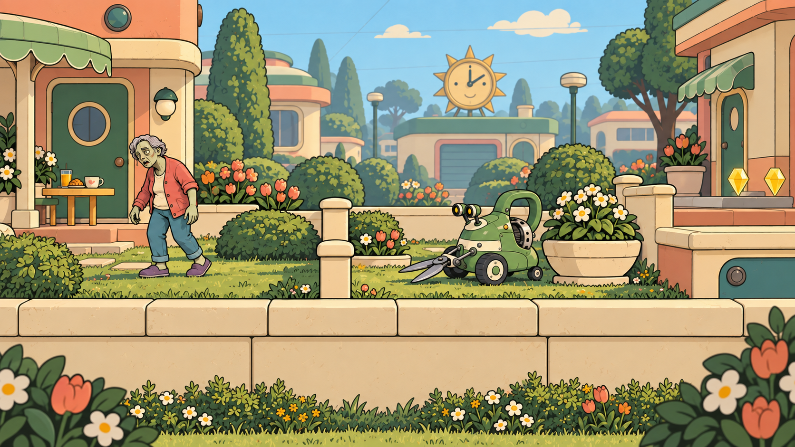

# DEAD EDEN — Selected 2D concept art

**Approved visual direction (C11):** [Hand-drawn 2D](../art-design/style-guide.md) — clean outlines, flat colors, cel shadows and layered scenery. [Selected references](README.md).

The user selected the generated **hand-drawn 2D style** for the game (C11): clean outlines, flat painted colors, crisp cel shadows and layered scenery. These five images are the current approved visual references.

| Asset / area | Selection and notes | Image | Continuation prompt |
| --- | --- | --- | --- |
| R01 Clipper | [B identity in 2D](r01-clipper/SELECTED.md) | [Clipper](r01-clipper/r01-clipper-2d-v1.png) | [Prompt](r01-clipper/generation-prompt.md) |
| Z01 Resident | [Selected Resident](z01-resident/SELECTED.md) | [Resident](z01-resident/z01-resident-2d-v1.png) | [Prompt](z01-resident/generation-prompt.md) |
| L01-A02 Front gardens | [Sunnyvale gallery](l01-sunnyvale/README.md) | [Gardens](l01-sunnyvale/l01-a02-front-gardens-2d-v1.png) | [Scene prompts](l01-sunnyvale/generation-prompts.md) |
| L01-A04 Neighborhood square | [Sunnyvale gallery](l01-sunnyvale/README.md) | [Square](l01-sunnyvale/l01-a04-neighborhood-square-2d-v1.png) | [Scene prompts](l01-sunnyvale/generation-prompts.md) |
| L01-A06 Quarantine exit | [Sunnyvale gallery](l01-sunnyvale/README.md) | [Exit](l01-sunnyvale/l01-a06-quarantine-exit-2d-v1.png) | [Scene prompts](l01-sunnyvale/generation-prompts.md) |

Use these images with the [shared 2D guide](../art-design/style-guide.md), individual [art briefs](../art-design/README.md) and written [level briefs](../level-design/README.md). The selected style applies to all remaining assets; it does not assign an approved appearance to an asset that has no selected image yet.

Only the five selected images are stored here. Earlier rendered candidates are superseded. Each PNG is an illustration, not a completed sprite sheet or separated environment kit. Written mechanics and routes remain authoritative where a generated scene is ambiguous.

[Decision register](../design/decisions.md) · [AI entry guide](../AI_START_HERE.md)
