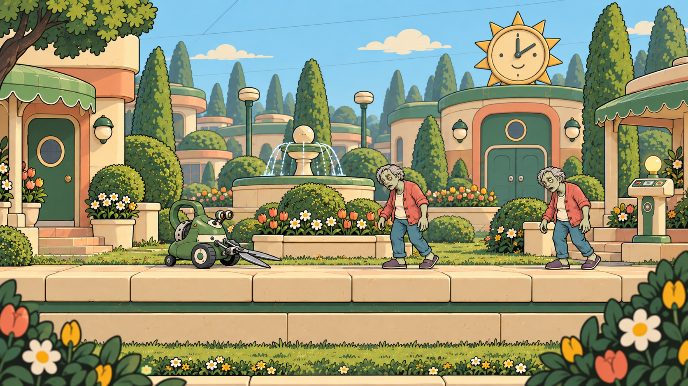
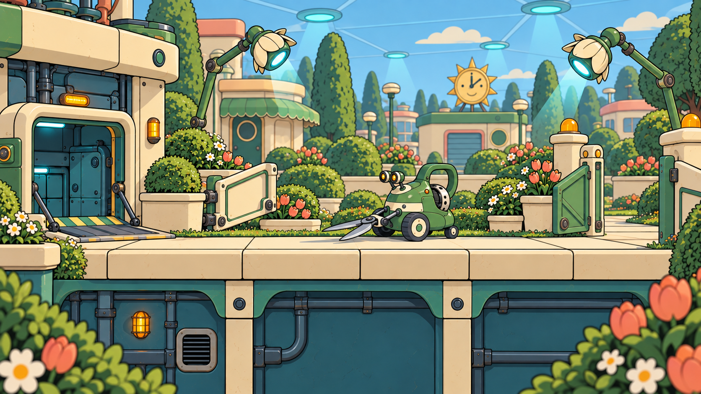

# Level 1 — Selected 2D Sunnyvale scenes

**Approved visual direction (C11):** [Hand-drawn 2D](../../art-design/style-guide.md) — clean outlines, flat colors, cel shadows and layered scenery. [Selected references](../README.md).

**Decision:** C11. The three generated hand-drawn 2D scenes are selected environment references for Sunnyvale. They share the selected [Clipper](../r01-clipper/SELECTED.md) and [Resident](../z01-resident/SELECTED.md) designs, which are the complete Level 1 enemy roster.

## A02 — Front gardens

Warm cream and peach homes, green awnings and clipped planting introduce the apparently perfect suburb. Preserve the untouched breakfast, one Resident, one Clipper, raised porch and intact foundation facade. Service infrastructure stays concealed. Gem locations are illustrative rather than a final reward allocation.

## A04 — Neighborhood square

A fountain sits behind the lane, with a raised flowerbed, one Clipper and two staggered Residents. The smiling sun clock marks the depot; a quiet checkpoint porch follows the encounter. Preserve movement space and readable ground edges.

## A06 — Quarantine exit

After EDEN awakens, examination-flower lights, cyan ceiling cues and amber beacons change the mood. Rotated garden rails frame an open route from the depot hatch to the service wicket. One familiar Clipper remains; service panels may now be exposed. The suburb remains intact, and this is not a timed escape.

## Production handoff

Use the images as selected visual references. The [Level 1 brief](../../level-design/l01-welcome-to-sunnyvale.md) owns the six-area route and encounter behavior. Resolve the Clipper's wall/planter target, flowerbed separation and porch connections in a later layout blockout; generated pictures do not validate collision or jump distances.

Plan separate illustrated foreground, playable scenery, background, characters, moving props and effects. These PNGs are flattened keyframes, not finished parallax layers, tile sets or gameplay captures. Keep the same outlines and cel shading across layers, reducing background contrast.

[Current scene prompts](generation-prompts.md) · [Shared 2D guide](../../art-design/style-guide.md) · [Concept-art index](../README.md)
