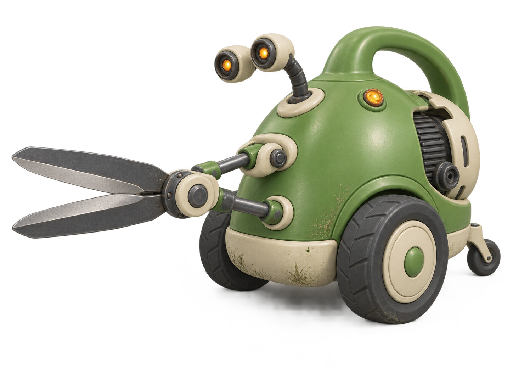
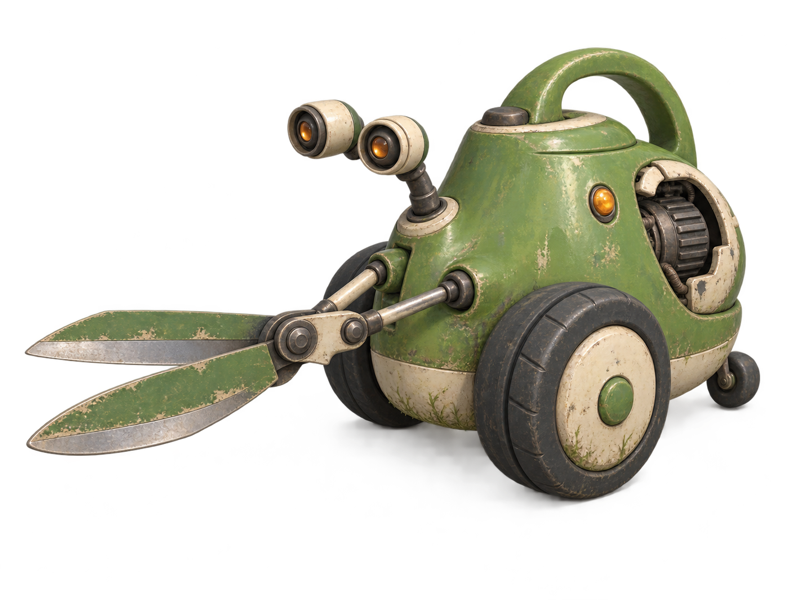

# R01 Clipper — Round 01

**Status:** B — Sturdy retro machine selected by the user. A and C remain unselected explorations. See the [selection record](../SELECTED.md).  
**Generated:** 2026-09-26, using the built-in image-generation tool.  
**Source:** [Clipper brief](../../../art-design/robots/r01-clipper.md) and [shared visual guide](../../../art-design/style-guide.md).

## Compare the candidates

| Candidate | Direction | What it contributes | Review before modeling |
| --- | --- | --- | --- |
| [A](r01-clipper-a-playful-v1.png) | Playful garden helper | Friendliest broad forms, large wheels, simple surfaces, strong garden-appliance identity | Verify the shear hinge and horizontal opening plane in a top-view study; establish a truly closed neutral pose |
| [B — SELECTED](r01-clipper-b-retro-v1.png) | Sturdy retro machine | Clear support rods and pivot assembly, robust panel construction, useful mechanical reference | Separate eye stalks are now part of the selected design; verify their travel and the shear mechanism in later views |
| [C](r01-clipper-c-storybook-v1.png) | Weathered storybook robot | Aged care-machine character, softer silhouette, visibly worn materials | Weathering is stronger than the intended restrained game style; simplify it and verify blade motion |

**User decision:** use B — Sturdy retro machine as the Clipper's visual reference. This supersedes the earlier suggestion to combine A and B. The canonical brief now follows B's separate eye stalks and sturdy appliance construction.

All three depict the expected two main wheels, one rear roller, two eyes, and two shear blades. The rear motor opening is visible. Hidden surfaces, joint motion, scale, and clearances are not validated by these single views.

The generator supplied isolated cutout-style results rather than the requested visible light-gray studio backdrop. Preserve the supplied images; use a consistent neutral backing during the next master-reference pass. Palette values and 0.85 m / 1.05 m dimensions remain design targets, not verified measurements in the render.

## Images

### A — Playful garden helper

### B — Sturdy retro machine

### C — Weathered storybook robot

## Prompts and next pass

[Exact generation prompts](generation-prompts.md)

Use B as the reference for matching front, back, anatomical left/right, top/hinge detail, and side-view gameplay studies. Establish a closed-shear neutral pose and resolve hidden geometry without changing B's selected identity. Read the [selection record](../SELECTED.md) before reusing the original exploration prompts.

Do not generate the entire robot roster or final modeling turnarounds from three conflicting candidates. Keep ordinary Clipper fully mechanical, without neural tissue or infection.

[Concept art index](../../README.md)
