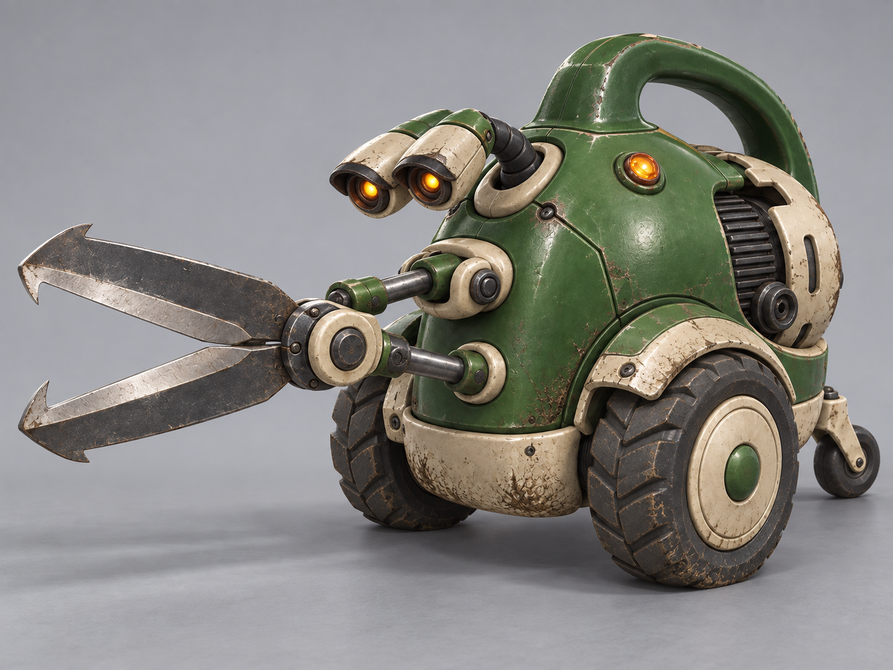

# R01 Clipper — Round 02: scarier direction

**Status:** Unselected darker exploration, retained for history. [B — Sturdy retro machine](../SELECTED.md) is the selected Clipper design.  
**Generated:** 2026-09-26 with the built-in image-generation tool, editing [candidate A](../round-01/r01-clipper-a-playful-v1.png).

## D — Menacing garden predator

This version lowers the eye assembly into a hunting posture, adds hooded amber lenses, sharpens and hooks the two shears, strengthens the wheel fenders and tire tread, and darkens the green enamel. It retains the watering-can body, integrated carry handle, two main wheels, one rear roller, two eyes, paired drive rods, and rear motor opening.

The more pointed blades and stronger wear were deliberate visual proposals responding to the request for a scarier version. They do not add a new attack, faction, enemy type, infection, or gameplay statistic. The user subsequently selected B; this darker candidate does not alter the canonical Clipper.

## Review before turnarounds

The silhouette and major component counts are readable. The render still suggests a side-facing pivot and vertically opening shears rather than the requested horizontal cutting plane. Correct that assembly in the selected master or explicitly decide to revise the original motion design before modeling. Do not treat this image as a mechanically verified blueprint.

Surface wear is stronger than the original clean, colorful direction. A later refinement can retain the menacing eyes and posture while simplifying scratches for gameplay scale. The neutral studio background keeps the design visible without relying on darkness alone.

[Exact edit prompt](generation-prompt.md) · [Previous three candidates](../round-01/README.md) · [Clipper brief](../../../art-design/robots/r01-clipper.md) · [Concept art index](../../README.md)
