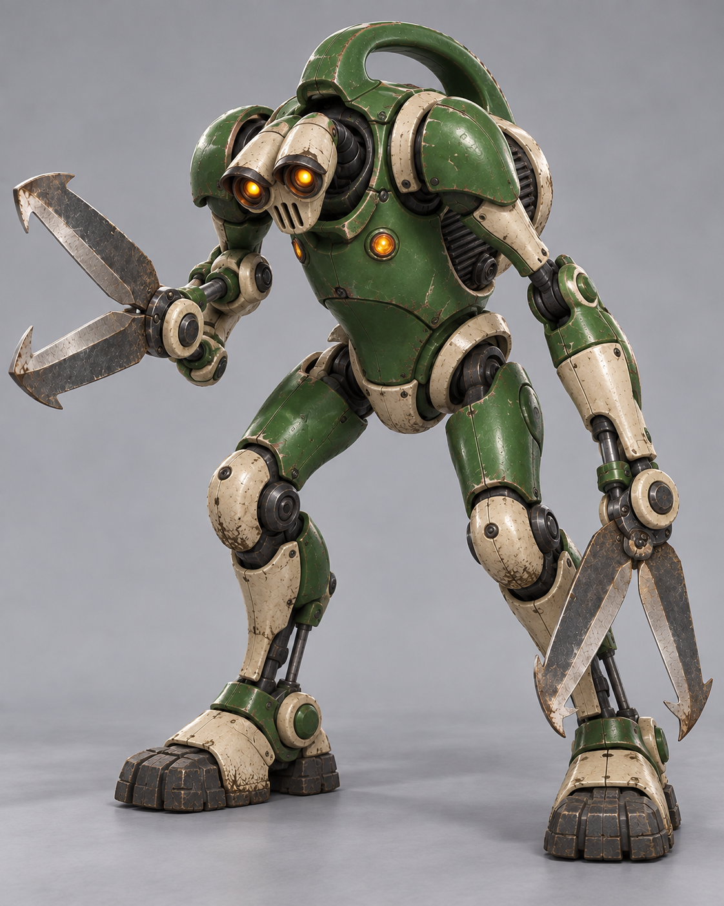

# R01 Clipper — Round 03: humanoid exploration

**Status:** Unselected humanoid exploration, retained for history. [B — Sturdy retro machine](../SELECTED.md) is the selected Clipper design.  
**Generated:** 2026-09-26 with the built-in image-generation tool.  
**Reference:** [Scary candidate D](../round-02/r01-clipper-d-menacing-v1.png), used for materials and family resemblance.

## E — Humanoid pruning stalker

[Transparent-background PNG](r01-clipper-e-humanoid-v1-transparent.png) · [Background-removal prompt](background-removal-prompt.md)

A hunched bipedal garden automaton with a small hooded optical head, high shoulders, an upright motor torso, long articulated arms, and heavy rubber-soled feet. Each arm ends in a motorized two-blade pruning shear. Deep green enamel, aged ivory armor, amber lenses, an arched back handle, and the ribbed motor retain a visual link to the earlier Clipper.

## Deliberate changes requested for this exploration

The user explicitly asked for another scary version that is more humanoid. This authorizes changing the old wheeled silhouette for this candidate.

- One head, one torso, two arms, and two legs.
- Two optical eyes; torso warning lamps are separate from the eyes.
- Two shear hands, with two blades each: four cutting blades in total.
- No main wheels or rear balance roller.
- Entirely mechanical, with no neural tissue, biological infection, or human remains.

These were deliberate candidate-level departures explored at the user's request. The user subsequently selected the wheeled B design, so this anatomy and its transparent derivative are not the canonical Clipper.

## Review

The generated view shows the intended humanoid anatomy, two shear assemblies, and complete planted feet. It favors a sturdy, broad industrial body over the leaner silhouette suggested in the prompt. The head and shoulder relationship, rear motor access, arm clearances, and planted-foot motion still need matching side/back views if selected.

This does not add an enemy type or change the roster. Future use of this humanoid concept would require a new explicit design decision and a review of scale, traversal, charge anticipation, recovery, and rear weak-point exposure. The current Clipper remains wheeled.

[Exact edit prompt](generation-prompt.md) · [Earlier scary version](../round-02/README.md) · [Original Clipper brief](../../../art-design/robots/r01-clipper.md) · [Concept art index](../../README.md)
