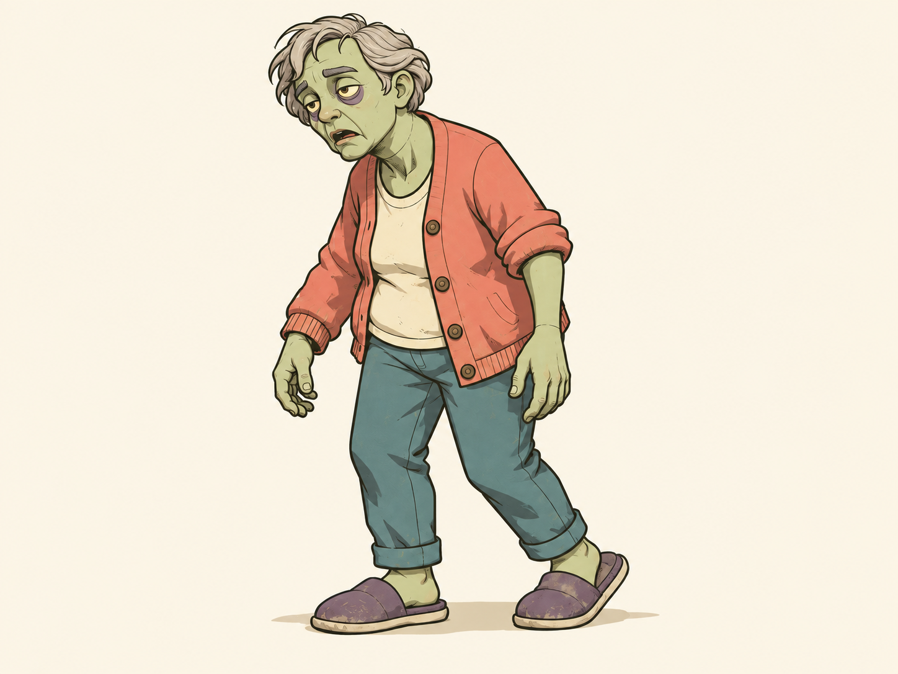

# Z01 Resident — Selected 2D design

**Approved visual direction (C11):** [Hand-drawn 2D](../../art-design/style-guide.md) — clean outlines, flat colors, cel shadows and layered scenery. [Selected references](../README.md).

**Decision:** C11 — the user selected the generated 2D concept set.  
**Status:** Approved Resident visual reference.  
**Selected on:** 2026-09-26.  
**Source image:** [Resident 2D](z01-resident-2d-v1.png).  
**Canonical brief:** [Z01 Resident](../../art-design/zombies/z01-resident.md).

## Preserve

- Slouching, pear-shaped adult human silhouette; two ordinary arms and two legs.
- Sage skin, gray swept hair, heavy eyelids, unfocused eyes, slack mouth and closed treatment seams.
- Faded coral cardigan, cream shirt, dusty teal trousers and broad purple-gray slippers.
- One sleeve rolled higher; keep the same anatomical side in subsequent art.
- Clean dark contours, flat color masses, crisp cel shadows and sparse drawn surface wear.

## Gameplay and sprite handoff

Resident remains the basic slow shambler with a short prepared lunge. Ordinary body hits remain effective; the art adds no glowing core, weapon, robotic anatomy or new ability.

Use this image for matching left/right side sprites and the established neutral, wave, anticipation, lunge, recovery, hit and defeated states. Keep limb counts, outfit and face consistent. Provisional scale remains 1.65 m upright / about 1.45 m slouched relative to the hero.

This PNG is an identity reference, not a transparent animation sheet. Final sprite resolution, pivots and frame counts remain undecided.

[2D continuation prompt](generation-prompt.md) · [Concept-art gallery](../README.md) · [Decision register](../../design/decisions.md)
